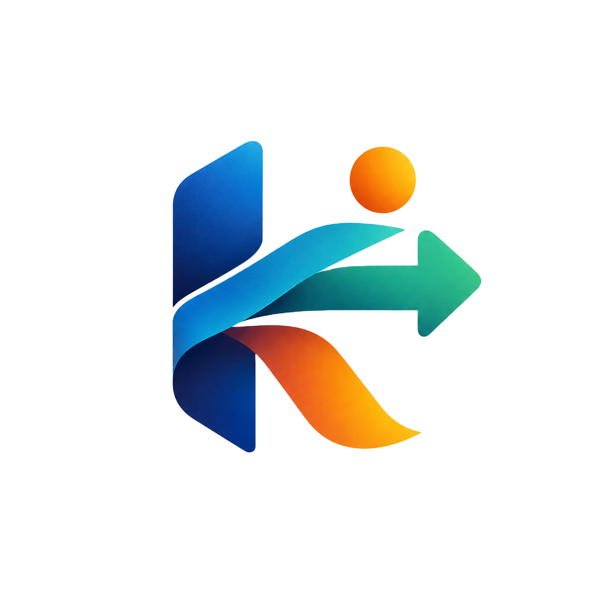

# KONVEY — Keep work moving.

<p align="center">
  
</p>

<p align="center">
  <strong>The intelligent workspace for understanding and moving complex work forward.</strong><br>
  High-velocity project execution with structured blocker intelligence, institutional memory, and executive client collaboration.
</p>

<p align="center">
  <a href="https://konvey-a357d.web.app/"></a>
  
  
  
  
  
</p>

---

## 🌟 Executive Overview

**KONVEY** is an enterprise-grade project operations and delivery platform designed for high-performing engineering and product teams (50–200 employees). Unlike generic task boards that devolve into stale lists and fragmented chat threads, KONVEY treats **blockers, dependencies, and decisions as first-class architectural entities**.

KONVEY provides:
- **Instant 1-Click Role Portals:** Dedicated experiences for Administrators, Project Managers, Engineers, and External Clients.
- **Strict Client Portal Isolation:** Clients monitor milestone delivery dates, question schedule delays, suggest enhancements, and adjust contract scope without exposing internal team chatter, Kanban triage, or developer tooling.
- **Enterprise Security Hardening:** Comprehensive pre-launch audit remediation across 11 OWASP Top 10 categories, multi-tenant Firestore security rules, brute-force lockout, and input boundary validation.
- **Complete Meta & Brand System:** Built-in Favicon & Brand Asset Showcase, Privacy Policy, Terms of Service, Security Attestation, and XML Sitemaps.

---

## 🚀 Key Architectural Pillars

### 1. Blocker Radar & Dependency Chains
- Explicit blocker classification: **Technical Debt**, **Cross-Team Hand-off**, **External Vendor**, and **Access / Credentials**.
- Live critical-path calculation highlighting which tasks are halting downstream releases.
- Assigned resolution ownership with clear resolution criteria to prevent milestone slips.

### 2. 60-Second AI Context Recovery
- Returning from vacation, focus days, or cross-functional meetings? 
- Click **"Catch Up"** to receive an executive briefing summarizing completed tasks, blockers cleared, new dependencies, and decisions made while you were away.

### 3. Decision Memory (ADR Registry)
- Preserves architectural and product decisions alongside the exact tasks and code they impact.
- Documents rationale, alternatives considered, decision authors, and superseding logs so institutional knowledge is never lost to employee turnover.

### 4. Distraction-Free Focus Engine
- Deep-work session timer (25m / 50m / 90m) that automatically pauses non-critical workspace notifications.
- Paused notifications are safely queued and revealed in a single, calm batch once the focus session ends.

### 5. Scope Creep Radar & Baseline Diffing
- Attribution tracking for requirement adjustments against initial scope baselines.
- Quantifies delivery target variance and contract boundary impact before committing changes to active sprints.

---

## 👥 Role-Based Workspaces & Personas

KONVEY provides tailored experiences out of the box. Users begin from the **Auth Launchpad** where they can authenticate via work email or select a 1-click persona:

| Persona | Role | Primary Workspace Capabilities |
| :--- | :--- | :--- |
| **Samira Wilson** | `admin`<br>*(VP of Product Operations)* | Organization-wide health metrics, team creation, member role assignment & transfer, security controls, backup/import, AI context recovery engine. |
| **Rahul Sharma** | `manager`<br>*(Senior Project Manager)* | Multi-project workspaces, sprint target dates, milestone roadmap, blocker radar, client change request reviews & approvals. |
| **Alex Chen** | `member`<br>*(Lead Frontend Engineer)* | Drag-and-drop sprint Kanban, critical blocker reporting, deep-work focus sessions, personal assigned tasks. |
| **Elena Rostova** | `client`<br>*(VP of Digital, Apex Global)* | **Isolated Client Executive Portal:** Real-time milestone delivery countdown, question schedule delays, suggest feature changes, submit contract requirement modifications. |

> **Client Persona Isolation:** When authenticated as `client`, all internal developer controls (Floating Dock, Global ⌘K Search, + New Task CTA, Settings, Guided Tour) are locked out. The interface presents strictly the 4 client-facing collaboration surfaces.

---

## 🛡️ Pre-Launch Security Audit & Hardening

KONVEY has undergone a pre-launch application security audit covering 11 OWASP Top 10 and cloud architecture categories:

1. **Authentication & Session Handling:** Enforced credential validation via Firebase Auth, eliminated fallback logins, and implemented anti-user-enumeration error responses.
2. **Multi-Tenant Boundary Isolation:** Firestore Security Rules and Cloud Storage Rules verify that `request.auth.uid` belongs to the target `organizationIds` before permitting reads or writes.
3. **Privilege Escalation Prevention:** Firestore rules strictly bar client modifications to `role` or `organizationIds`. Public sign-ups default to `member`.
4. **Input Sanitization & Boundary Limits:** Centralized sanitization pipeline (`sanitizeTitle` ≤ 180 chars, `sanitizeDescription` ≤ 4,000 chars, strict backup JSON schema verification).
5. **Brute-Force & Rate Limiting:** Client-side 5-attempt threshold with a mandatory 30-second exponential lockout timer.
6. **HTTP Security Headers:** Configured in `firebase.json` with `Content-Security-Policy`, `X-Frame-Options: DENY`, `X-Content-Type-Options: nosniff`, `Strict-Transport-Security`, and `Permissions-Policy`.
7. **Clean Dependencies:** Pinned stable Vite `v6.4.4`, resolving all path traversal and NTLM disclosure advisories with 0 build warnings.

---

## 🎨 Brand Identity, Favicon & Meta Pages

KONVEY includes a built-in public documentation and brand asset showcase accessible directly from the Auth page and in-workspace account menu:

- **Favicon & Brand Page (`/?meta=brand`):**
  - **Standard Favicon:** `public/favicon.svg` (high-contrast vector mark) and `public/favicon.ico`.
  - **Apple Touch Icon:** `public/apple-touch-icon.png` (180×180 maskable).
  - **PWA Web Manifest:** `public/site.webmanifest` (192×192 & 512×512 icons).
  - **Interactive Previews:** Simulated Google Chrome & Apple Safari browser tab mockups, iOS/Android home screen icon grids, brand color tokens, and 1-click SVG copy/download tools.
- **Security & Compliance (`/?meta=security`):** Executive audit attestation and RBAC permissions matrix.
- **Privacy Policy (`/?meta=privacy`):** Enterprise data sovereignty, zero-training AI guarantee, GDPR/CCPA rights.
- **Terms of Service (`/?meta=terms`):** Multi-tenant enterprise SLA (99.9% availability commitment) and fair use policies.
- **System Sitemap (`/?meta=sitemap`):** Complete visual routing hierarchy and information architecture.
- **Search Engine Sitemaps:** Valid standard `public/sitemap.xml` and `public/robots.txt`.

---

## 💻 Tech Stack

- **Frontend Core:** React 19 (`react`, `react-dom`)
- **Language & Type Safety:** TypeScript 5.7 (strict mode)
- **Build & Bundler:** Vite 6.4.4 with ES modules
- **Styling Architecture:** Pure CSS Modules (`*.module.css`) with CSS custom properties design tokens
- **Backend & Cloud:** Google Cloud Platform & Firebase (Authentication, Cloud Firestore, Cloud Storage, Hosting)
- **Iconography:** Lucide Icons (`lucide-react`) + Custom Vector SVG geometry
- **Code Quality:** Oxlint & TypeScript compiler (`tsc -b`)

---

## 🛠️ Local Development & Quick Start

### Prerequisites
- Node.js `18.0.0` or later
- npm `9.0.0` or later

### 1. Installation
```bash
git clone https://github.com/your-org/konvey.git
cd konvey
npm install
```

### 2. Environment Configuration
Copy the template configuration file:
```bash
cp .env.example .env.local
```
Fill in your Firebase project credentials in `.env.local`:
```ini
VITE_FIREBASE_API_KEY=your_api_key
VITE_FIREBASE_AUTH_DOMAIN=konvey-a357d.firebaseapp.com
VITE_FIREBASE_PROJECT_ID=konvey-a357d
VITE_FIREBASE_STORAGE_BUCKET=konvey-a357d.appspot.com
VITE_FIREBASE_MESSAGING_SENDER_ID=your_sender_id
VITE_FIREBASE_APP_ID=your_app_id
```

### 3. Start Development Server
```bash
npm run dev
```
Open [http://localhost:5173](http://localhost:5173) in your browser. The app starts at the **Auth Launchpad** with 1-click persona options.

### 4. Code Quality & Linting
```bash
npm run lint
```

### 5. Production Build & Typecheck
```bash
npm run build
```

---

## 🌐 Firebase Deployment

Deploy hosting, Firestore security rules, and storage rules:
```bash
# 1. Build production assets
npm run build

# 2. Deploy to Firebase
firebase deploy --only hosting,firestore:rules,storage
```

Production deployment URL: **[https://konvey-a357d.web.app](https://konvey-a357d.web.app)**

---

## 📁 Repository Directory Structure

```
konvey/
├── public/
│   ├── favicon.svg             # Responsive vector SVG brand mark
│   ├── favicon.ico             # 16x16 / 32x32 standard favicon
│   ├── apple-touch-icon.png    # 180x180 iOS touch icon
│   ├── logo.png                # High-res master brand mark
│   ├── site.webmanifest        # PWA configuration manifest
│   ├── sitemap.xml             # Search engine XML sitemap
│   └── robots.txt              # Crawler access directives
├── src/
│   ├── components/
│   │   ├── admin/              # Org settings, backup/restore, security controls
│   │   ├── auth/               # AuthPage, 1-click personas, brute-force lockout
│   │   ├── intelligence/       # BlockerRadar, DecisionMemory, FocusMode, ContextRecovery
│   │   ├── layout/             # TopBar, AppShell, FloatingNavbar, Sidebar
│   │   ├── meta/               # MetaPagesView (Brand/Favicon, Security, Privacy, Terms, Sitemap)
│   │   ├── projects/           # ProjectWorkspace, Kanban, Gantt, MemberManagement
│   │   ├── ui/                 # Accessible primitives (Badge, Button, Drawer, Modal, Toast)
│   │   └── views/              # DashboardView, MyWorkView, TeamsView, ClientPortalView
│   ├── context/
│   │   ├── AuthContext.tsx     # Authentication, RBAC, session management
│   │   └── OrgContext.tsx      # State store, Firestore sync, permissions gating
│   ├── data/
│   │   └── seedData.ts         # Initial multi-tenant workspace data & personas
│   ├── services/
│   │   ├── storageService.ts   # Local persistence & session state
│   │   └── syncService.ts      # Real-time Firestore synchronization
│   ├── utils/
│   │   ├── permissions.ts      # Granular RBAC permission matrix
│   │   └── sanitize.ts         # XSS sanitization & input boundary validation
│   ├── App.tsx                 # Root router, logo loading screen, meta routing
│   └── main.tsx                # React DOM mount point
├── firestore.rules             # Multi-tenant Firestore security rules
├── storage.rules               # Multi-tenant Cloud Storage security rules
├── firebase.json               # Firebase Hosting configuration & HTTP security headers
└── package.json                # Project dependencies & build scripts
```

---

## 📄 License & Attribution

Designed and engineered for high-velocity teams. © 2026 KONVEY Technologies. All rights reserved.
